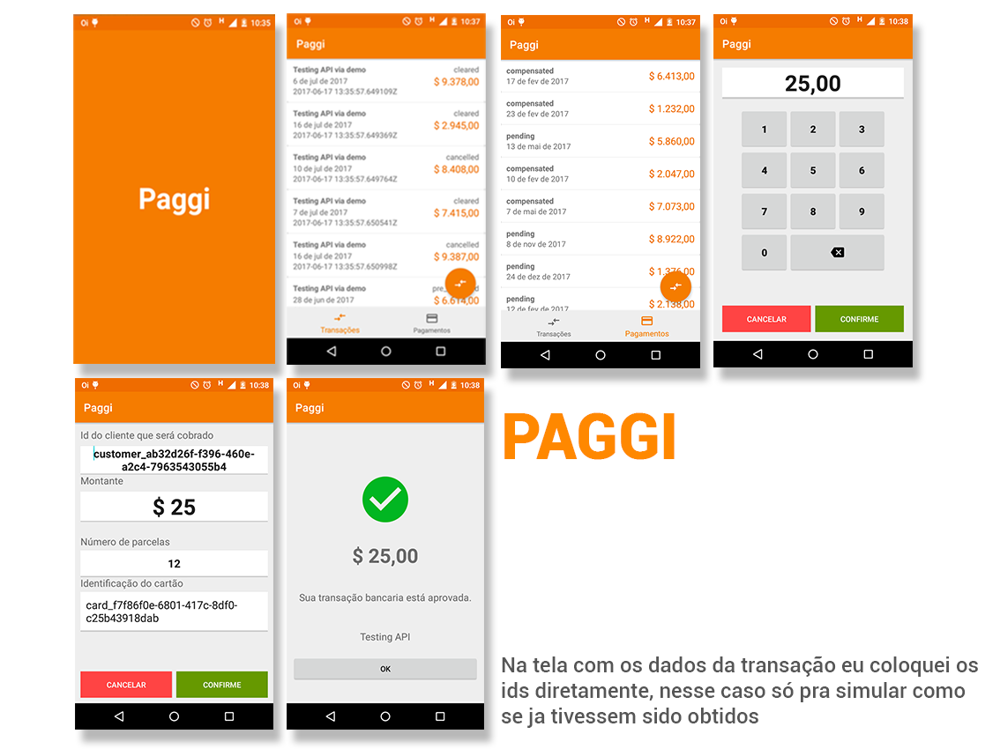

# Teste Mobile

# Rafael Felipe

## Contato
E-mail: rafael.felipe1989@gmail.com

# Informações do projeto

## Bibliotecas

[Retrofit2](http://square.github.io/retrofit/) Um cliente HTTP

[Retrofit2:converter-gson](http://square.github.io/retrofit/) Parser json para Retrofit

[Android Scroll Endless](https://github.com/rafaelcrz/android_scroll_endless) Biblioteca criada por mim para uso de Scroll com paginação em Recycler.

[Android Joda Time](https://github.com/dlew/joda-time-android) Poderosa library para manipulação de datas/horas

## Navegação Activties

* SplashScreenActivity - Tela de Splash com o logo Paggi.
* MainActivity - Tela principal, contém dois fragments (Transações e Pagamentos) que são alternados por meio de BottomNavigationView..
* AmountValueActivity - Tela que simula visualmente uma maquina de cartão, onde o usuário informa o valor do montante.
* ConfirmTransactionActivity - Tela onde recebe os dados do Cliente, Montante, Id do cartão e número de parcelas. (Os ids estão inseridos diretamente nos campos de texto, apenas pra simulação.)
                               Essa tela envia ao webservice os dados para uma nova transação.
* TransactionResultActivity - Tela que exibe o resultado da Transação. Essa tela recebe via Intent da tela anterior.
							   
## Navegação Fragments

* TransactionFragment - Fragment que lista todas as Transações. (usando paginação)
* PaymentFragment - Fragment que lista todos os Payments. (usando paginação)

## Telas

							 							   
# Descrição do teste

Nesse teste é preciso criar um app com 3 telas, usando a API do [Paggi](http://docs.paggi.com/), com o token de DEMO (`B31DCE74-E768-43ED-86DA-85501612548F`)

## Criar transação
Criar transação com os campos:

 - `amount` - Valor transacionado
 - `installments_number` - Número de parcelas
 - `card_id` - Cartão que será transacionado

[API](http://docs.paggi.com/docs/charges-2)

## Listar transações
Lista transações com os campos:

 - `status` - Status da transação
 - `amount` - Valor transacionado
 - `expected_compensation` - Data que a transações será compensada
 - `created_at` - Data que a transação foi feita

[API](http://docs.paggi.com/docs/charges)

## Listar pagamentos
Lista de pagamentos com os campos:

 - `amount` - Valor liquido que foi compensado
 - `compensated_at` - Data que compensação foi feita
 - `status` - Status da compensação

[API](http://docs.paggi.com/docs/compensations)

#### Obs
* Não se preocupe com a consistencia dos dados retornados pela API, pois nossa chave de DEMO não persisti os dados
* UX será considerado um diferencial nesse teste
* Ao terminar, abra um PR do repo principal e entraremos em contato

## Boa sorte e que a força esteja com você !
